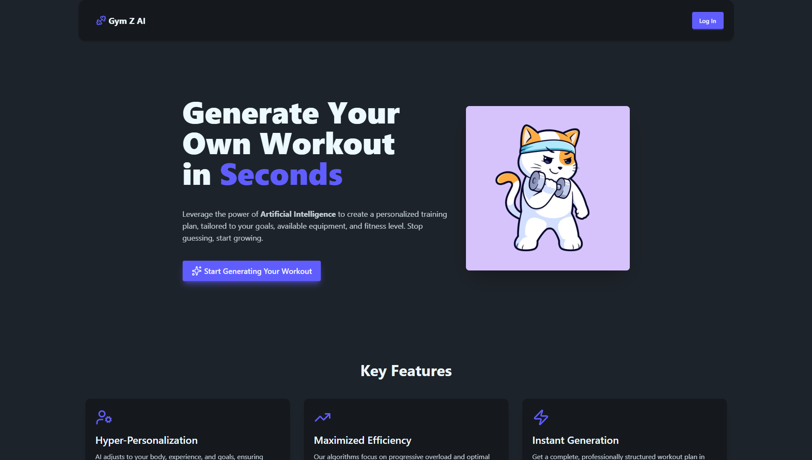
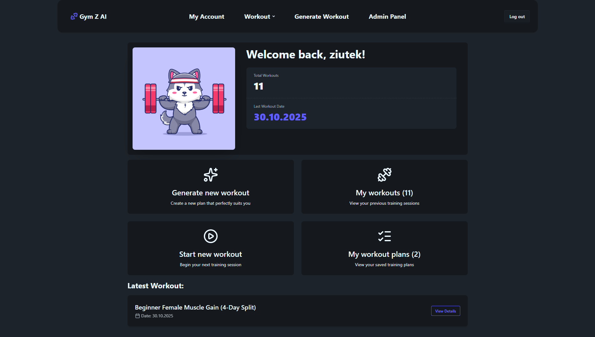
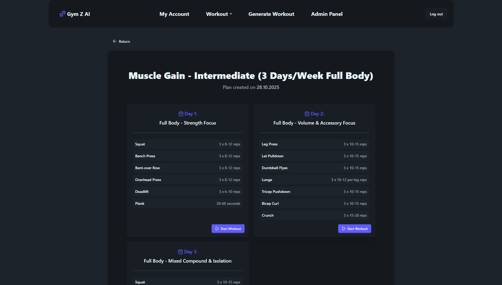
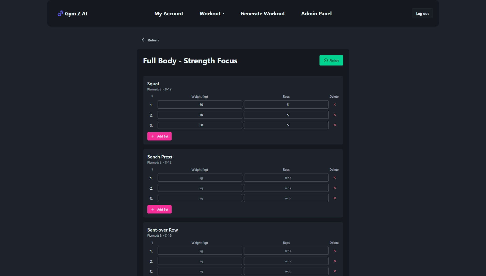

# Gym Z AI - AI-Powered Workout Management Application

## Project Description

Gym Z AI is a full-stack web application designed to help users take control of their fitness journey. Its key and distinguishing feature is the **real-time generation of personalized workout plans** using the advanced Gemini model from Google.

**Key Features:**

- **AI Workout Plan Generation:**
  - Creates personalized workout plans based on user preferences (fitness goal, gender, experience level, available equipment, frequency).
  - Utilizes the **Gemini** model (Google GenAI) to optimize and structure workouts.
- **Comprehensive Workout Logging:**
  - Accurate tracking of workout sessions, including start and end times.
  - Option to log details of each set performed: set number, weight, and repetitions.
- **Authorization and Account Management:**
  - Secure user registration and login using password hashing.
  - Authentication via **JWT** (JSON Web Tokens) and HTTP-only cookies.
- **Admin Panel:**
  - Dedicated interface for users with the **ADMIN** role, allowing management of registered accounts, including role changes (`USER` or `ADMIN`) and account deletion.

## Screenshots









## Application Architecture

The project is built on a client-server architecture. The entire environment (excluding API keys) is containerized and managed using **Docker Compose**.

### Main Components:

1.  **Frontend (`frontend`):** React/Vite client application.
2.  **Backend (`backend`):** Node.js/Express API server.
3.  **Database (`db`):** PostgreSQL container for persistent data storage.
4.  **Adminer (`adminer`):** A lightweight web tool for database management.

### Database Schema (Prisma)

The application uses **PostgreSQL** as the database, with the schema managed by **Prisma ORM**.

| Model             | Description                                                                    |
| :---------------- | :----------------------------------------------------------------------------- |
| `User`            | User information, including role (`role`) and fitness preferences.             |
| `WorkoutPlan`     | The main workout plan generated by the AI (e.g., "Beginner Muscle Gain Plan"). |
| `WorkoutDay`      | A single workout day within the plan (`dayNumber`, `focus`).                   |
| `WorkoutExercise` | A specific exercise within a workout day (planned `sets` and `reps`).          |
| `Exercise`        | Central library of available exercises.                                        |
| `WorkoutSession`  | A saved log of a completed workout session.                                    |
| `LoggedSet`       | Detailed data on each set performed during a session (weight, reps).           |

## Setup Instructions

To run the application locally, you need **Docker** and **Docker Compose** installed.

1.  **Clone the Repository:**

    ```bash
    git clone https://github.com/basiagaoskar/ai-workout-generator
    cd ai-workout-generator
    ```

2.  **Set Environment Variables (Backend):**
    Create an `.env` file in the `backend/` directory and add the Gemini API key.

    ```.env
    GEMINI_API_KEY="YOUR_API_KEY"
    DATABASE_URL="postgresql://user:password@db:5432/mydatabase"
    JWT_SECRET="your_jwt_secret_key"
    ```

3.  **Run the Application with Docker Compose:**
    In the root project directory (`ai-workout-generator-main`), execute:

    ```bash
    docker-compose up --build
    ```

    This command will build and start the `db`, `backend`, `frontend`, and `adminer` containers.

4.  **Access Services:**
    - **Web Application (Frontend):** `http://localhost:5173`
    - **Backend API:** `http://localhost:3000`
    - **API Documentation (Swagger UI):** `http://localhost:3000/api-docs`
    - **DB Management (Adminer):** `http://localhost:8080`
      - System: `PostgreSQL`
      - Server: `db`
      - User: `user`
      - Password: `password`
      - Database: `mydatabase`
